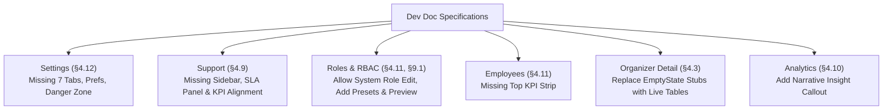

# Implementation Plan: Full Compliance with Zordr Admin Portal Technical Dev Doc (`docs/dev_doc.pdf`)

## 1. Overview & Objectives

An audit of the codebase against [dev_doc.pdf](file:///d:/ZORDR%20Internship/Eventer/zordr-event-admin/docs/dev_doc.pdf) verified that the core foundation, routing, authentication, and primary workflows for all 16 screens are functional and tests pass cleanly. 

However, several specific screen requirements, sub-views, and business rules outlined in Sections 4, 9, and 13 of the document have partial implementations or omissions. This plan provides a phased roadmap to bring the entire application to 100% compliance with the technical specification.

---

## 2. Gap Analysis Summary

---

## 3. Phased Implementation Roadmap

### Phase 1: Settings Screen Architecture Overhaul (§4.12)
**Goal:** Replace the monolithic fee form with the full 7-tab enterprise settings interface.

1. **Tab Structure**:
   Implement a tabbed layout in [SettingsForm.tsx](file:///d:/ZORDR%20Internship/Eventer/zordr-event-admin/src/features/settings/components/SettingsForm.tsx) covering:
   - `General`: Organization profile, preferences, platform info, recent activity log, danger zone.
   - `Users & Access`: Quick link to staff directory and access policies.
   - `Notifications`: Email/SMS operational alert configurations.
   - `Payments`: Platform fee schedule (authoritative `FeeConfig`), convenience fees, gateway limits.
   - `Platform`: Maintenance mode switch, system version, environment status.
   - `Security`: Session timeouts, password rotation policies, audit log retention.
   - `Integrations`: RazorpayX credentials, AWS SES/SendGrid status, Sentry status.

2. **General Tab Components**:
   - **Organization Profile**: Organization name, support email, contact number, registered address, logo preview/URL.
   - **Preferences**: Timezone selector (`Asia/Kolkata` default), Date/Time format (`DD/MM/YYYY`, 12h/24h), Currency (`INR (₹)`), Language, Items per page (`10, 15, 25, 50`).
   - **Platform Information**: Plan (`Enterprise Control Plane`), Member since date, Total events created, Total registered users, Storage utilized.
   - **Danger Zone**: "Delete Organization" section with red callout, Super-Admin role guard (`<Can module="settings" action="delete">`), and confirmation modal requiring typing `DELETE ORGANIZATON`.

3. **Data & Schema**:
   - Extend [`settingsSchema`](file:///d:/ZORDR%20Internship/Eventer/zordr-event-admin/src/features/settings/schemas.ts) and types in `types.ts`.
   - Update mock data in `mock.ts` and route handler in `src/app/api/admin/settings/route.ts` to support saving preferences and organization details.

---

### Phase 2: Support Screen Sidebar & SLA Panel (§4.9)
**Goal:** Deliver the required operational sidebar and align KPIs with §4.9.

1. **KPI Strip Alignment**:
   - Update [`SupportList.tsx`](file:///d:/ZORDR%20Internship/Eventer/zordr-event-admin/src/features/support/components/SupportList.tsx) KPIs to:
     - `Total Tickets`
     - `Resolved Tickets`
     - `Open Tickets`
     - `Avg. Response Time` (e.g., `2.4h` with trending badge)
   - Update [`useSupportKpis`](file:///d:/ZORDR%20Internship/Eventer/zordr-event-admin/src/features/support/hooks.ts) and mock return data.

2. **Support Operational Sidebar**:
   Create `SupportSidebar.tsx` and integrate it alongside the tickets list:
   - **Ticket Categories Breakdown**: Category counts (`Tickets`, `Payments`, `Refunds`, `Event Info`, `Orders`, `Accessibility`, `General`) that act as fast filters on click.
   - **Quick Actions**:
     - `Create Ticket` (opens a ticket creation modal)
     - `View FAQs` (links to support documentation)
     - `Support Inbox` / `Live Chat` status indicator
   - **Support SLA Panel**:
     - First Response Time target: `< 6 hours` (status: `98.2% on-time`)
     - Resolution Time target: `< 24 hours` (status: `94.5% on-time`)
     - Customer Satisfaction: `4.7 / 5.0` (with star rating visual)

---

### Phase 3: Roles & RBAC Matrix Refinement (§4.11 & §9.1)
**Goal:** Adhere strictly to the business rule that system roles can have permissions edited, and provide preset tools.

1. **System Role Permission Editing**:
   - In [`RoleEditorModal.tsx`](file:///d:/ZORDR%20Internship/Eventer/zordr-event-admin/src/features/roles/components/RoleEditorModal.tsx), remove the `isReadonly` lock on permission checkboxes for system roles. System roles can have their permissions customized and saved, while their name/slug and deletion remain protected.

2. **Role Creation Matrix Enhancements**:
   - Add convenience action buttons:
     - **Select All**: Check all (View, Create, Edit, Delete, Export) across all modules.
     - **Deselect All**: Uncheck all permissions.
     - **Presets Dropdown**: Pre-populate permission matrix with presets (`Read-Only Observer`, `Operations Manager`, `Event Moderator`, `Finance Specialist`).
   - Add **Live Quick Preview & Permission Summary**:
     - Real-time count of enabled capabilities (e.g., `18 / 65 permissions granted`).
     - Summary pills of privileged actions (e.g. `Can Export Orders`, `Can Manage Settlements`).

---

### Phase 4: Employees Screen KPI Strip (§4.11)
**Goal:** Add the missing top-level employee overview metrics.

1. **KPI Strip Addition**:
   - In [`EmployeesList.tsx`](file:///d:/ZORDR%20Internship/Eventer/zordr-event-admin/src/features/employees/components/EmployeesList.tsx), introduce a `<KpiStrip>` displaying:
     - `Total Employees`
     - `Active Employees`
     - `Invited / Pending`
     - `Inactive`
   - Dynamically compute counts from employee dataset.

---

### Phase 5: Organizer Detail Sub-tabs Completion (§4.3)
**Goal:** Replace empty stubs with functional views populated from the centralized mock datastore.

1. **Revenue Tab**:
   - Create `OrganizerRevenueTab.tsx`:
     - Lifetime GMV, Commission paid, Net payout received, and Average Order Value.
     - Breakdown table by event with tickets sold and gross revenue.
2. **Settlements Tab**:
   - Create `OrganizerSettlementsTab.tsx`:
     - Filter and render settlements linked to the specific organizer using existing `mockSettlementsList`.
     - Display period, gross sales, fees, net payout, and payout status.
3. **Support Tickets Tab**:
   - Create `OrganizerSupportTab.tsx`:
     - Filter and render support tickets originated by or associated with this organizer from `mockSupportTicketsList`.

---

### Phase 6: Analytics Narrative Insight Callout (§4.10)
**Goal:** Integrate automated performance commentary.

1. **Insight Callout Banner**:
   - In [`AnalyticsDashboard.tsx`](file:///d:/ZORDR%20Internship/Eventer/zordr-event-admin/src/features/analytics/components/AnalyticsDashboard.tsx), add a high-impact narrative insight card:
     - Dynamic summary of top drivers (e.g., *"Event registrations grew by 14.8% over the selected period, driven by Music & Tech festivals in Bengaluru and Mumbai."*)
     - Alert badges for anomalies (e.g., payment failure spikes or high refund categories).

---

### Phase 7: Verification, Tests & Build Validation
1. **Unit & Integration Tests**:
   - Add tests for new Settings tabs, Support sidebar interactions, and Role presets.
   - Run Vitest test suite (`npm test -- --run`).
2. **Production Build**:
   - Run `npm run build` to verify 100% type safety and static optimization.

---

## 4. Key Questions & Design Decisions for User

1. **Settings Persistence Scope**: In mock mode (`NEXT_PUBLIC_USE_MOCK_API=true`), should updated general preferences (like currency and timezone) persist to `localStorage` so they alter the format helpers across the entire app during the user's session?
2. **System Role Permissions**: Should the Super Admin role specifically remain immutable (all permissions checked and locked) to prevent an admin from locking themselves out of the portal, while other system roles (Event Manager, Operations Manager, etc.) allow full permission editing?
